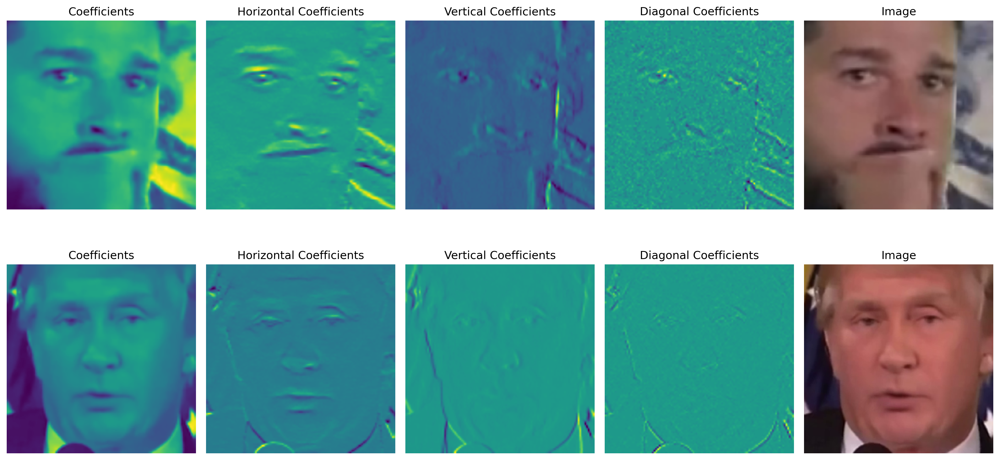

# Deepfake Deepfake Detection Techniques Using Frequency Analysis



## Project Overview

* **Problem Statement:** Traditional deepfake detectors rely on visible spatial artifacts, leading to poor generalization as generative models (GANs, Diffusion) become more advanced. This project explored intrinsic generative footprints found in the frequency domain.

* **The Goal:** To systematically compare the effectiveness of three major spectral representations (FFT, DCT, and DWT) in identifying deepfake artifacts under real-world conditions.

* **Dataset:** WildDeepfake (internet-sourced, real-world compressed video frames).


### Technical Implementation & Methodology

* **Architecture**: Used a consistent ResNet-18 backbone for a fair feature comparison, adapting the initial convolutional layer to support variable channel inputs (e.g., 2-channel FFT, 4-channel DWT).

* **Preprocessing**: Implemented and normalized the 2D transforms: Fast Fourier Transform (Amplitude + Phase), Discrete Cosine Transform (DCT), and Discrete Wavelet Transform (DWT) using Haar wavelets.

* **Diagnostic Finding**: Identified that naïve concatenation of FFT Amplitude and Phase spectra hurt performance, suggesting a requirement for advanced cross-attention fusion.


### Results & Conclusion

* **Key Insight**: DWT significantly outperformed other spectral representations (FFT, DCT) because its multi-scale decomposition captures localized high-frequency inconsistencies often lost in global transforms.

* **Final Model**: The ultimate RGB + DWT Hybrid Model (simple channel concatenation) achieved the highest overall performance (AUC=0.8698, F1=0.8328), confirming that spatial and spectral features provide complementary cues for robust detection.

### Future Work

Future plans include implementing advanced fusion techniques (e.g., transformer-based attention) and incorporating temporal frequency analysis (3D-CNNs) to extend this work to video deepfakes.


## Environment Setup

### Install Environment

To install the conda environment with the necessary dependencies installed, enter the following in the command prompt:
```
source .bashrc # activate conda bash
conda env create -f environment.yml
```

### Activating Environment

To activate an existing conda environment, enter the following into the command prompt:
```
source activate
conda activate df-env
```

To check your conda environments, enter: 
```
source env list
```


## Project Directory Guide (Detailed)
- `config.py`: Project configuration variables (paths, default settings).
- `environment.yml`: Conda environment specification for reproducible environments.
- `playground/`: Notebooks used for experiments, visualization, and exploratory analysis.
- `hf_wdf.sh`, `run_jupyter.sh`: Helper shell scripts for running experiments and notebooks on SLURM.
- `analysis/`: Output visualizations and analysis artifacts (gradcam, metrics, sample images).
- `playground/experiments/`: Experimental notebooks split by transform type (`dct`, `dwt`, `fft`, `rgb`) and fusion strategies.
- `reports/`: Saved training/evaluation logs, Lightning `metrics.csv` and `hparams.yaml` for each trained model variant.
- `setup/`: Utility and provisioning scripts used to prepare datasets and job scripts for cluster runs.
- `src/`:
	- `utils.py`: Small utility helpers used across the project.
	- `adapters/`: Dataset adapter code for loading and preprocessing datasets (`deepfakeface.py`, `sida.py`, `wilddeepfake.py`).
	- `models/`: Model definitions (e.g., `resnet.py`, `freqnet.py`, `encoder_decoder.py`).
	- `transforms/`: Signal/image transform implementations and fusion helpers (`frequency.py`, `fusion.py`).

## Contributing
You are free to use this code for educational and research purposes. If you find any issues or have suggestions for improvements, please feel free to open an issue or submit a pull request.